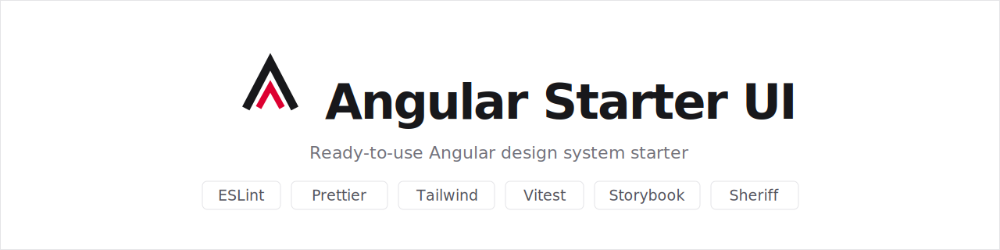

<picture>
  <source media="(prefers-color-scheme: dark)" srcset=".github/assets/banner-dark.svg" />
  
</picture>
<br>
<br>

[](https://github.com/JoanRoucoux/angular-starter-ui/actions/workflows/ci.yml)
[](https://angular.dev)
[](https://storybook.js.org)
[](LICENSE)
[](https://pnpm.io)

Ready-to-use Angular starter for building a design system: a publishable component library (standalone, zoneless, signals) and a Storybook workshop, with every best practice and tool already wired up.

The starter ships a documented set of design tokens (neutral zinc scale, light and dark via `light-dark()`) and three example components (button, input, badge) showing the conventions: signal inputs, host class bindings, Tailwind utilities consuming the tokens, stories with interaction tests, and 100% unit test coverage.

## Stack

| Tool                                                                                                                                                                                   | Role                                                     |
| -------------------------------------------------------------------------------------------------------------------------------------------------------------------------------------- | -------------------------------------------------------- |
| [Angular 22](https://angular.dev) + [ng-packagr](https://github.com/ng-packagr/ng-packagr)                                                                                             | Framework and library build (Angular Package Format)     |
| [Storybook 10](https://storybook.js.org) (`@storybook/angular-vite`)                                                                                                                   | Component workshop: autodocs, a11y addon, theme switcher |
| [Tailwind CSS](https://tailwindcss.com)                                                                                                                                                | Utility-first CSS consuming the design tokens            |
| [ESLint](https://eslint.org) + [angular-eslint](https://github.com/angular-eslint/angular-eslint) + [eslint-plugin-storybook](https://github.com/storybookjs/eslint-plugin-storybook)  | Lint for TypeScript code, templates and stories          |
| [Prettier](https://prettier.io) + [sort-imports](https://github.com/trivago/prettier-plugin-sort-imports) + [tailwindcss](https://github.com/tailwindlabs/prettier-plugin-tailwindcss) | Code formatting, import ordering and class sorting       |
| [Vitest](https://vitest.dev) + [Testing Library](https://testing-library.com/docs/angular-testing-library/intro)                                                                       | Unit tests (Angular's default runner)                    |
| [Storybook test-runner](https://github.com/storybookjs/test-runner)                                                                                                                    | Runs every story and its `play` interaction tests in CI  |
| [Sheriff](https://sheriff.softarc.io)                                                                                                                                                  | Enforces module boundaries (components stay isolated)    |
| [Husky](https://typicode.github.io/husky) + [lint-staged](https://github.com/lint-staged/lint-staged)                                                                                  | Git hooks (format + lint on commit)                      |
| [commitlint](https://commitlint.js.org)                                                                                                                                                | Commit message validation (Conventional Commits)         |
| GitHub Actions                                                                                                                                                                         | CI: format, lint, unit tests, builds, interaction tests  |

## Getting started

```bash
pnpm install    # installs dependencies
pnpm start      # Storybook on http://localhost:6006
```

Storybook is the development surface: components are built and reviewed through their stories, there is no demo application.

## Scripts

| Script                       | Description                                                        |
| ---------------------------- | ------------------------------------------------------------------ |
| `pnpm start`                 | Storybook dev server on `http://localhost:6006`                    |
| `pnpm run build`             | Builds the library into `dist/ui` (Angular Package Format)         |
| `pnpm run build:dev`         | Development build of the library                                   |
| `pnpm run build-storybook`   | Builds the static Storybook into `storybook-static/`               |
| `pnpm test`                  | Unit tests (Vitest)                                                |
| `pnpm run test:coverage`     | Unit tests with coverage report and thresholds                     |
| `pnpm run test-storybook`    | Interaction tests against a running Storybook (`pnpm start` first) |
| `pnpm run test-storybook:ci` | Serves `storybook-static/` and runs the interaction tests on it    |
| `pnpm run lint`              | Lint (ESLint)                                                      |
| `pnpm run lint:fix`          | Lint with automatic fixes                                          |
| `pnpm run format`            | Format the whole project (Prettier)                                |
| `pnpm run format:check`      | Check formatting without modifying anything                        |

## Project structure

```txt
.storybook/                  # Storybook config: main.ts, preview.ts (theme switcher), preview.css
projects/ui/
├── ng-package.json          # ng-packagr config (entry point, shipped assets)
├── package.json             # Library manifest (rename before publishing)
├── styles/
│   └── tokens.css           # Design tokens — shipped as dist/ui/styles/tokens.css
├── docs/                    # Storybook "Foundations" MDX pages (colors, typography)
└── src/
    ├── public-api.ts        # The library's only entry point
    └── lib/
        ├── button/          # button.ts + button.spec.ts + button.stories.ts
        ├── input/
        └── badge/
```

Each component lives in its own folder with its spec and stories co-located. Dependency rules, enforced at lint time by [Sheriff](https://sheriff.softarc.io) ([sheriff.config.ts](sheriff.config.ts)): components cannot import each other — shared building blocks get their own module. Modules are barrel-less: import files directly (no `index.ts`), and place files a module wants to keep private in an `internal/` subdirectory. `public-api.ts` is the single public entry point of the package.

## Design tokens and theming

All colors come from [projects/ui/styles/tokens.css](projects/ui/styles/tokens.css), a pure token sheet (no resets, no element styles) shipped with the package. Tokens follow the [shadcn/ui](https://ui.shadcn.com/docs/theming) semantic convention on a neutral zinc scale.

Each token declares its light and dark value with `light-dark()`; the active scheme follows the OS preference unless the host forces one:

```html
<html data-theme="dark">
  <!-- forces dark, whatever the OS says -->
</html>
```

The Storybook toolbar theme switcher does exactly that, so every story can be reviewed in both themes. Components consume tokens through Tailwind arbitrary-value utilities (`bg-(--primary)`, `border-(--border)`, ...): retheming means editing one CSS file. The tokens are documented in Storybook under **Foundations**.

## Components

Three example components demonstrate the conventions (prefix `ui`, signal inputs, host class bindings):

| Component | Selector            | API                                                                              |
| --------- | ------------------- | -------------------------------------------------------------------------------- |
| Button    | `button[ui-button]` | `variant`: primary \| secondary \| destructive \| ghost — `size`: sm \| md \| lg |
| Input     | `input[uiInput]`    | Styled native input: works with any forms API without plumbing                   |
| Badge     | `ui-badge`          | `variant`: primary \| secondary \| destructive \| outline                        |

Button and input attach to native elements (Material-style attribute selectors), keeping native semantics, accessibility and forms compatibility for free:

```html
<button ui-button variant="destructive" size="sm">Delete</button>
<input uiInput type="email" placeholder="you@example.com" />
<ui-badge variant="outline">Draft</ui-badge>
```

## Storybook

- **Autodocs**: every story is tagged `autodocs` globally ([.storybook/preview.ts](.storybook/preview.ts)); each component gets a generated docs page from its stories and `argTypes`.
- **Accessibility**: the [a11y addon](https://storybook.js.org/addons/@storybook/addon-a11y) runs axe checks on every story.
- **Theming**: the toolbar switcher toggles `data-theme` on `<html>` via `withThemeByDataAttribute`, matching the tokens' `light-dark()` contract.
- **Interaction tests**: stories declare `play` functions (imports from `storybook/test`); the [test-runner](https://github.com/storybookjs/test-runner) executes every story in Chromium in CI (`pnpm run test-storybook:ci`).
- **Foundations**: MDX pages in [projects/ui/docs](projects/ui/docs) document the color tokens (light and dark swatches) and typography.

## Using the library in your app

The publishable artifact is built from `projects/ui` into `dist/ui`. Before publishing, rename the package in [projects/ui/package.json](projects/ui/package.json) (e.g. `@your-scope/ui`) — the root `package.json` version is the starter's own version (managed by release-please), the library version is managed in `projects/ui/package.json`.

In the consuming app:

1. Install the package and its peer dependencies (`@angular/common`, `@angular/core`).
2. Import the token sheet once, e.g. in `styles.css`:
   ```css
   @import '@your-scope/ui/styles/tokens.css';
   ```
3. **Tailwind consumers**: the library's templates are inside `node_modules`, which Tailwind does not scan by default. Add a [`@source`](https://tailwindcss.com/docs/detecting-classes-in-source-files#explicitly-registering-sources) so the utilities used by the components are generated:
   ```css
   @import 'tailwindcss';
   @source '../node_modules/@your-scope/ui';
   ```
   Non-Tailwind consumers only need the tokens import: component class names would then need to be covered by your own CSS strategy — in that case prefer forking the components into your design system, which is what a starter is for.

The library exports each component's own types so you never recreate them. Every variant/size union comes with a matching `as const` tuple (the single source of truth the type is derived from), so you get both the type and the runtime list:

```ts
import { BUTTON_VARIANTS, type ButtonVariant } from '@your-scope/ui';

// Type your own props with the library's union...
function setTone(variant: ButtonVariant) {
  /* ... */
}

// ...and iterate the values without hardcoding them (selects, validation, docs).
const options = BUTTON_VARIANTS.map((variant) => ({ label: variant, value: variant }));
```

Exported today: `ButtonVariant` / `BUTTON_VARIANTS`, `ButtonSize` / `BUTTON_SIZES`, `BadgeVariant` / `BADGE_VARIANTS`.

## Testing

- **Unit tests** use [Angular Testing Library](https://testing-library.com/docs/angular-testing-library/intro) (`render`, `screen`, `userEvent`): querying by role or label asserts accessibility for free. The [jest-dom](https://github.com/testing-library/jest-dom) matchers are registered in [projects/ui/src/test-setup.ts](projects/ui/src/test-setup.ts).
- **Coverage** is at 100% and must stay there; the CI thresholds (85/80/70/85 in [angular.json](angular.json)) are intentionally lower so downstream users of the starter are not blocked. Stories are excluded from coverage.
- **Interaction tests** live in the stories themselves (`play` functions) and run in a real browser via the Storybook test-runner — the Vitest addon is not used because it does not support Angular.

## Quality and conventions

- **On commit**: lint-staged formats and lints the staged files; commitlint enforces [Conventional Commits](https://www.conventionalcommits.org) (`feat: ...`, `fix: ...`, ...).
- **In CI** ([.github/workflows/ci.yml](.github/workflows/ci.yml)): format check, lint, unit tests, library build, Storybook build and interaction tests on every push/PR.
- **Code conventions**: see the [Angular style guide](https://angular.dev/style-guide). In short: standalone components (`OnPush` change detection is the Angular default since v22, no need to declare it), signals (`input()`, `computed()`), `inject()`, private `#` properties, control flow (`@if`, `@for`), no `.component`/`.directive` suffix in file names.
- **Config files** use ESM `.mjs` where the tool supports it: [eslint.config.mjs](eslint.config.mjs), [prettier.config.mjs](prettier.config.mjs), [commitlint.config.mjs](commitlint.config.mjs).

## Contributing

See [CONTRIBUTING.md](.github/CONTRIBUTING.md) for the contribution workflow and [CODE_OF_CONDUCT.md](.github/CODE_OF_CONDUCT.md) for community guidelines. To report a vulnerability, see [SECURITY.md](.github/SECURITY.md).

## License

This project is licensed under [MIT](LICENSE).
